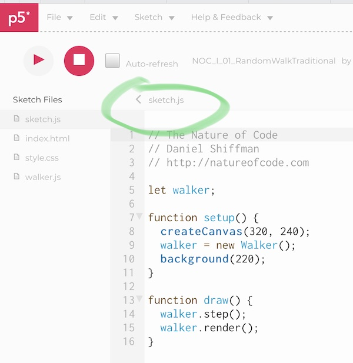

# Week 1: Introduction

### Readings and videos:
*Not required, however I think you might find these interesting. Looking forward to discussing your thoughts.*

- 3blue1brown: Very nice animation of all kinds of math and physics problems:
[3blue1brown youtube channel](https://www.youtube.com/channel/UCYO_jab_esuFRV4b17AJtAw/featured)
- The Antykithera mechanism, decoding nature 2500 years ago
[Decoding an Ancient Computer (pdf)](http://www.cs.virginia.edu/~robins/Decoding_an_Ancient_Computer.pdf)
- [Chance vs. Randomness](https://plato.stanford.edu/entries/chance-randomness/)
- The Wikipedia Page on the [Linear Congruential Generator](https://en.wikipedia.org/wiki/Linear_congruential_generator), the pseudorandom number generator we have been looking at, is quite detailled. Feel free to follow the links at the botom 
- If you are interested in TEX and markup languages, maybe you find this old text of mine interesting: [TEX - digital typesetting](http://en.slow-media.net/tex)

**Books**
- [The computational beauty of nature](http://bobcat.library.nyu.edu/primo-explore/fulldisplay?docid=nyu_aleph001470337&context=L&vid=NYU&search_scope=all&tab=all&lang=en_US) : computer explorations of fractals, chaos, complex systems, and adaptation, by Gary William.
- [A New Kind of Science](http://bobcat.library.nyu.edu/primo-explore/fulldisplay?docid=nyu_aleph000778690&context=L&vid=NYU&search_scope=all&tab=all&lang=en_US) by Stephen Wolfram
- [Tilings and Patterns](http://bobcat.library.nyu.edu/primo-explore/fulldisplay?docid=nyu_aleph004382597&context=L&vid=NYU&search_scope=all&isFrbr=true&tab=all&lang=en_US) by B. Grunbaum and GC. Shephard.

### Material, scripts, etc:
- [Nature of Code Examples in p5.js](https://github.com/nature-of-code/noc-examples-p5.js)
- The html script [html_boilerplate.html](https://github.com/jbenno/nyuad_decoding_nature/blob/master/01_Introduction/html_boilerplate.html) is a simple template for a single web page to display the code in [test1.js](/test1.js)./
- Results can be viewed here: [https://jbenno.github.io](https://jbenno.github.io/nyuad_decoding_nature/01_Introduction/html_boilerplate.html)/
This is second link necessary since github.com does not directly allow the display of HTML files. We will explore github further during the course, so don't worry if you are not yet comfortable with using it.
- [w3schools](https://www.w3schools.com) is always a good ressource for HTML, CSS, and Javascript.
- [Mozilla](https://developer.mozilla.org/en-US/docs/Learn/JavaScript) has a nice introduction to Javascript.

There are a number of free editors for html, Javascript, and other languages, e.g. [Sublime Text](http://www.sublimetext.com) or [BBEdit](https://www.barebones.com/), and many others. Please feel free to try out and use whatever you feel comfortable with.

p5js.org provides a simple editor and sandbox environment, too. It is a very good first start to play arround with Javascript: [https://editor.p5js.org](https://editor.p5js.org).

### The random walk example
[The random walker](https://editor.p5js.org/natureofcode/sketches/Hk4LOoSvx)\
Remember how to get to the "hidden" files with the definition of the Walker's details: 

### Assignments
*We will discuss the results of your homework on Monday and Wednesday*

Playing with code is essential for your understanding of how the things here work. So please go ahead. Nothing can break. It is not important that you succeed (at least not always or immediately). Just play arround. Don't get stuck. If something isn't working, don't give it more than an hour - just move on to something different. Feel free to reach out to me - I am happy to sit together with you over your task on Tuesday.

1. Play with the random walker example. Create variations of it, e.g. by chaning colors, adding events or other Javascript features that you may find.
2. Change the random number generator from the standard JS function 'random()' to other functions to control the movement. This doesn't have to be (pseudo)random - anything that makes the dots move can be interesting.
3. Look at my raw version of a simple linear congruential generator [lcg.js](/01_Introduction/lcg.js). It is lacking any comments (which of course is very bad programming style - as you know or may easily imagine, it is very hard to learn from code without any hints being given). Try to comment the code so others can understand what it is about. If you don't know how to do this - try to look it up in a Javascript reference online (like the ones I mentioned above).
3. Sign up to [github](https://github.com) and open an account if you don't have an account yet.
